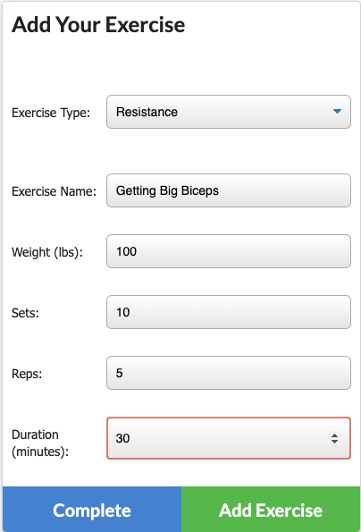
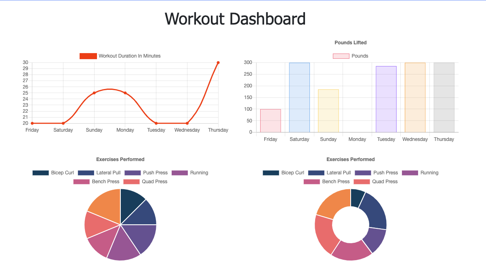
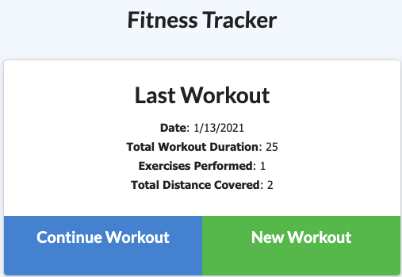

# fitness-tracker

## Description
This repository contains the code used to create an fitness tracker application. Aiming to make fitness goals more attainable, the app allows the user to easily log their daily workouts and track their progress in an organized fashion. The user is able to log the name, type, weight, reps, sets, and duration of their exercises. 

## Technologies
* Javascript
* MongoDB
* html
* node.js
* css

## Dependencies
* Express
* Mongoose
* Morgan

## Installation
In order to install necessary dependencies, please run the following command: npm i

## Features
Allows users to:
* Create a new workout plan or continue with their last workout
* Add exercises to the most recent work out plan
* Add new exercises to a new workout plan
* View combined weight of multiple exercises from their past seven workouts 
* View the total duration of each workout from their past seven workouts

## Preview

Adding a new exercise to a new or pre-existing workout

Statistical data for the weight and duration of the last 7 workouts

Home screen displays stats of last logged workout
